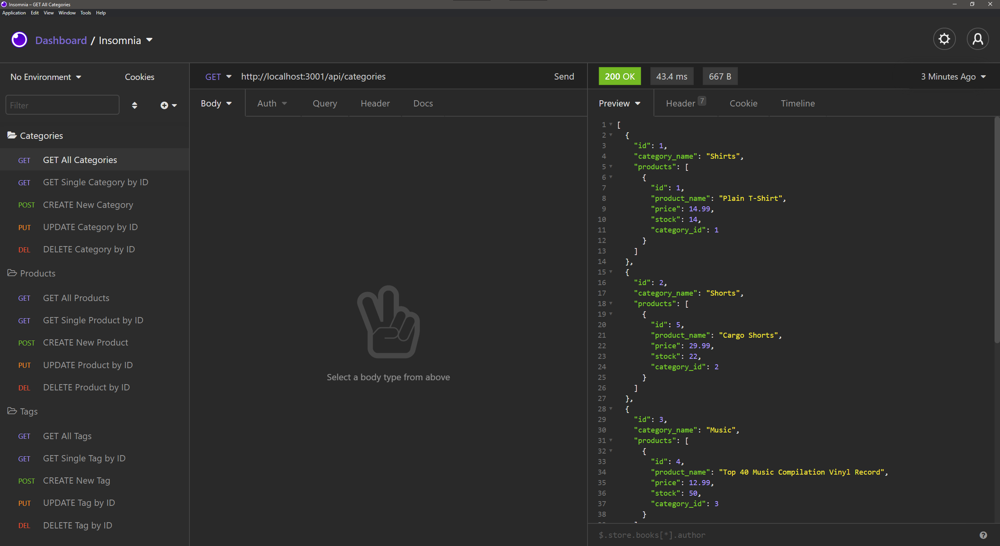

# 13 E-Commerce Back End

## Languages & Technologies
* Javascript
* Insomnia
* MySQL Workbench
* Node.js
* Express Package
* Dotenv Package
* MySQL2 Package
* Sequelize Package

## Description
This application can be used as a back end for an e-commerce site.

## Screenshot

## Demo
[Walkthrough Video](https://iamalittleforest.github.io/13-e-commerce-back-end/assets/images/README-walkthrough.mp4)

## License
MIT License

## Contact Information
Wendy Kobayashi (<wykobayashi@gmail.com>)